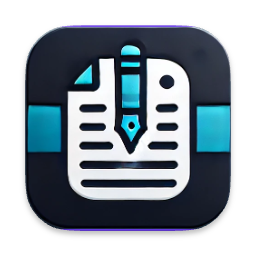

# Mou

**Mou** is a full-stack content management and personal blogging platform! ✍️ Built as both a learning project and a functional portfolio website, it features a powerful **Go backend** with a modern **React frontend**. The platform includes authentication via **Google Identity Services**, content management with **Google Drive** for static file storage, and an interactive commenting system for engaging with readers.

## 🔗 Links

## 🛠️ Tech Stack

### Backend

### Frontend

### APIs & Tools

## ✨ Features
- 📝 **Content Management System** for creating and managing blog posts
- 🔐 **Google OAuth Authentication** using Google Identity Services API
- 🔑 **JWT Authorization** for secure API access
- ☁️ **Google Drive Integration** for backing up and storing static content
- 💬 **Interactive Commenting System** with nested replies
- 👥 **User Management** with role-based permissions
- 📱 **Responsive Frontend** built with React and TypeScript
- 🐳 **Containerized Deployment** using Docker
- ☁️ **Cloud Hosted** on AWS EC2 (backend) and Netlify (frontend)

## 💼 My Contributions

- 👨‍💻 Developed the **complete Go backend** from scratch using **Fiber** framework and **GORM** ORM.
- ⚛️ Built the **React + TypeScript frontend**, marking my first deep dive into modern React development and TypeScript.
- 🔐 Implemented **Google Identity Services API** for authentication and **JWT** for secure authorization.
- ☁️ Integrated **Google Drive API** to automatically backup and store static content like images and files.
- 💬 Created an interactive **commenting and reply system** to foster reader engagement.
- 🐳 Containerized the application with **Docker** for consistent deployment across environments.
- ☁️ Deployed the backend on **AWS EC2** and the frontend on **Netlify**, managing the complete DevOps pipeline.
- 🗄️ Designed the **database schema** in PostgreSQL to efficiently handle blog posts, users, comments, and media.

## 💡 The Idea

After learning the basics of **Golang**, I wanted to build something substantial to solidify my understanding of the language and its ecosystem. At the same time, I was curious about **React** and **TypeScript** – technologies I had heard about but never used in a real project.

I decided to combine both learning goals into one project: a personal blogging platform that would also serve as my portfolio website. This gave me a clear purpose and real-world constraints – the platform had to be functional, user-friendly, and production-ready since I intended to actually use it.

The **Google APIs** integration was particularly interesting. Instead of building complex file storage from scratch, I leveraged the **Google Drive API** to handle static content backups. Similarly, **Google Identity Services** provided a robust, enterprise-grade authentication solution that users already trust.

This project wasn't just about building features – it was about understanding the entire full-stack development process, from API design and database modeling to frontend state management and cloud deployment. Every challenge taught me something valuable about building scalable, maintainable web applications.

## 🚀 Conclusion

Mou represents a significant milestone in my development journey! 🌟 It brought together backend expertise in Go, frontend skills in React and TypeScript, cloud services integration, and DevOps practices. More than just code, it's a complete learning experience that prepared me for building complex, production-ready applications. The platform successfully serves as both a functional blogging system and a testament to continuous learning and experimentation with new technologies.

