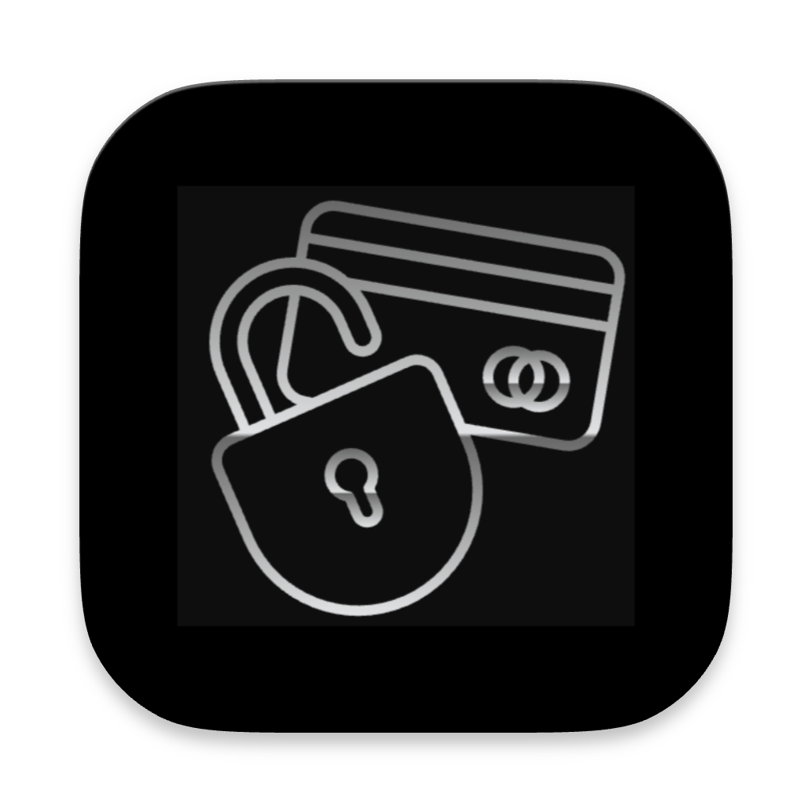

# Tizori

**Tizori** is a self-hosted credentials manager designed to simplify the secure sharing of credentials within teams! 🔐 It provides role-based access control (RBAC) to ensure that users can manage and share credentials effectively and securely. As the lead of a large community of developers, managers, and designers, I recognized the challenge of sharing credentials securely across various tools. Tizori is built to solve this problem, offering a free alternative to services like 1Password.

## 🔗 Links

## 🛠️ Tech Stack

<!-- ### Backend
- **Deployment**: Docker
- **Web API**: 
  - **Language**: Go
  - **Framework**: Fiber
  - **ORM**: GORM
  - **CLI Framework**: urfave/cli
  - **JWT**: golang-jwt
  - **UUID**: google/uuid
  - **AES Encryption**: crypto/aes
- **Admin Panel**:
  - **Language**: Python
  - **Framework**: Django
  - **Admin Template**: Jazzmin
- **Database**: PostgreSQL

### CLI
- **Language**: Python
- **Dependency Management**: Poetry
- **Framework**: Typer -->

## ✨ Features
- 🔒 **Role Based Access Control (RBAC)** for managing user permissions
- 💻 **CLI Interface for Clients** to interact with the credentials manager
- 🏠 **Self-Hosted** solution for enhanced security
- 🔐 **AES-256 Encryption of Credentials** for data protection
- 🔑 **JWT Authentication** for secure access
- 👥 **Multi-User Support** to manage team credentials
- 🛠️ **Admin Panel for User Management** to handle user roles and permissions

## 💼 My Contributions

- 👨‍💻 Developed the **entire Golang backend** from scratch, implementing core features for user management, role-based access control, and secure credential handling.
- ⚙️ Integrated **PostgreSQL** for data storage, ensuring robust and reliable data management.
- ☁️ Set up **Docker** for easy deployment and scalability.
- 🚀 Built the **Django-based admin panel** for user management and role assignment.
- 🛠️ Created the **CLI interface** using Python and Typer for efficient credential management and user interaction.

## 💡 The Idea

As the lead of a large community of developers, managers, and designers, I recognized the challenge of securely sharing access to different tools and credentials. It often became cumbersome to manage these credentials without compromising security.

I envisioned a solution akin to a free 1Password that would enable role-based permissions for reading or writing credentials, allowing me to assign roles to users effectively. This inspired the creation of **Tizori**, which provides a secure and manageable way to handle credentials within a team.

## 🚀 Conclusion

Tizori is not just a credentials manager; it's a vital tool for teams to collaborate securely and efficiently. Built with scalability in mind, it ensures that managing credentials is straightforward and safe, ready for future growth! 🌟
