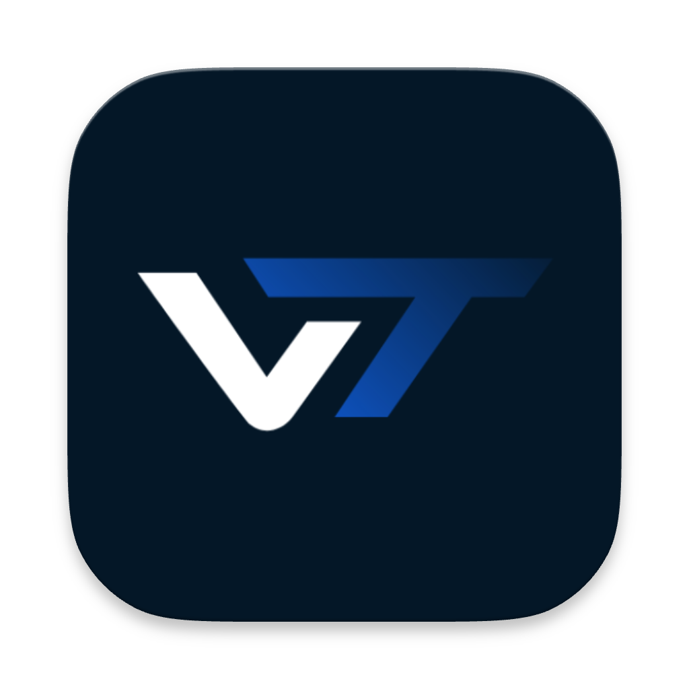

# Vitty Backend

**Vitty** is a must-have app for students of **Vellore Institute of Technology (VIT)**! 📚 It provides a seamless way to access your VIT timetable anytime, anywhere. Students can upload timetables as images or text, view them easily, and even **connect with friends** to check out their timetables. With over **40,000+ users** 🌍, Vitty is available on both the **Google Play Store** and the **Apple App Store**.

## 🔗 Links

## 🛠️ Tech Stack

<!-- ### 🛠️ Tools and Technologies:
- **Language**: [Golang](https://golang.org/) 
- **Framework**: [Fiber](https://gofiber.io/) 
- **ORM**: [GORM](https://gorm.io/) 
- **CLI Framework**: [urfave/cli](https://cli.urfave.org/) 
- **Authentication**: [Firebase Oauth2](https://firebase.google.com/) 
- **Database**: [PostgreSQL](https://www.postgresql.org/) 
- **Containerization**: [Docker](https://www.docker.com/) 
- **Hosting**: [Oracle Cloud](https://www.oracle.com/cloud/) -->

## ✨ Features
- 🔐 **Google Oauth2** for user authentication 
- 🕒 Detect timetables from VTOP page 
- 🤝 **Friend system**: add, remove, view friends’ timetables 
- 🔍 User search to connect with others 
- 📅 Display mutual friends and timetable overlaps
- 🤗 **Friend suggestions** based on mutual connections 
- ⚙️ **CLI tool** for managing the web API 

## 💼 My Contributions

- 👨‍💻 Built the **entire Golang backend** from scratch, including the **recommendation engine**, friend requests system, and logic for displaying **friends' timetables**.
- ⚙️ Implemented core features like timetable detection, user authentication, and friend suggestions.
- ☁️ Handled **cloud deployment and hosting** on **Oracle Cloud** with **Docker**, ensuring scalability and reliability.
- 🚀 Led the development of the **new Android and iOS apps**, and the website, ensuring timely completion and deployment.

## 💡 The Idea

While I was a student at VIT 🎓, I noticed how hard it was to access timetables via the official VIT app. It was often down or hard to use 😩, so most students just saved messy screenshots of their timetables. 

When I joined **GDSC-VIT**, I saw the potential in Vitty but realized the app had major backend limitations – Firebase (on a free tier) couldn’t handle the growing number of users. I decided to take on the challenge, rewrote the backend in **Golang**, and made it scalable with **PostgreSQL**.

I also introduced a **social feature** where students can **connect with friends** and check their timetables to see when they’re free for study sessions or hangouts. This revamp has made Vitty more efficient, reliable, and able to serve its **40,000+ active users** 📈.

## 🚀 Conclusion

Vitty is no longer just a timetable app 📅 – it’s now a social tool for **VIT students** to stay connected, organized, and in sync. The app is built to scale, with a user-friendly design and seamless performance, ready for future growth! 🌟
